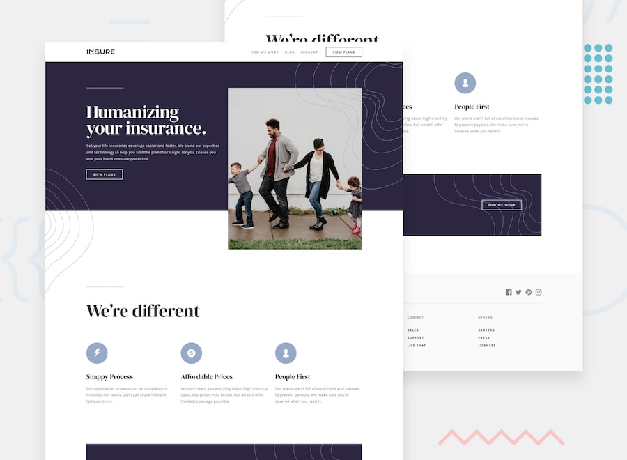

# Insure landing page


WordPress block theme implementation of **Insure landing page**.

## Table of contents

- [Overview](#overview)
  - [The job](#the-job)
  - [Links](#links)
- [My process](#my-process)
  - [Built with](#built-with)
  - [Useful resources](#useful-resources)
  - [AI Collaboration](#ai-collaboration)
- [Author](#author)

## Overview

### The job

Implement a WordPress block theme starting from the provided assets for the **Insure landing page**.

Users should be able to:

- View the optimal layout for the site depending on their device's screen size
- See hover states for all interactive elements on the page

### Links

- Solution URL: [Add solution URL here](https://github.com/ferfalcon/insure-landing-page)
- Live Site URL: [Add live site URL here](https://insure-landing-page.ferfalcon.shop/)

## My process

### Built with

- Semantic HTML5 markup
- CSS custom properties
- Flexbox
- CSS Grid
- Mobile-first workflow
- [WordPress](https://wordpress.org/) - Open source publishing platform
- [DDEV](https://ddev.com/) - Docker-based PHP development environment

### Useful resources

Install skills with pnpm 
```bash
pnpm dlx skills add <skill-url> --skill <skill-name>
```

- [Automattic | Agent skills](https://www.skills.sh/automattic/agent-skills) - Skills from Automatic.
- [Automattic | WP Project Triage](https://www.skills.sh/automattic/agent-skills/wp-project-triage) - Use this skill to quickly understand what kind of WordPress repo you’re in and what commands/conventions to follow before making changes.
- [Automattic | WordPress Router](https://www.skills.sh/automattic/agent-skills/wordpress-router) - Use this skill at the start of most WordPress tasks to:
  - identify what kind of WordPress codebase this is (plugin vs theme vs block theme vs WP core checkout vs full site),
  - pick the right workflow and guardrails,
  - delegate to the most relevant domain skill(s).
- [Automattic | WP-CLI and Ops](https://www.skills.sh/automattic/agent-skills/wp-wpcli-and-ops) - Use this skill when the task involves WordPress operational work via WP-CLI, including:
  - **`wp search-replace`** (URL changes, domain migrations, protocol switch)
  - DB export/import, resets, and inspections (**`wp db *`**)
  - plugin/theme install/activate/update, language packs
  - cron event listing/running
  - cache/rewrite flushing
  - multisite operations (**`wp site *`**, **`--url`**, **`--network`**)
  - building repeatable scripts (**`wp-cli.yml`**, shell scripts, CI jobs)
- [Automattic | WP Block Themes](https://www.skills.sh/automattic/agent-skills/wp-block-themes) - Use this skill for block theme work such as:
  - editing **`theme.json`** (presets, settings, styles, per-block styles)
  - adding or changing templates (**`templates/*.html`**) and template parts (**`parts/*.html`**)
  - adding patterns (**`patterns/*.php`**) and controlling what appears in the inserter
  - adding style variations (**`styles/*.json`**)
  - debugging “styles not applying” / “editor doesn’t reflect theme.json”.
- [Automattic | WP Block Development](https://www.skills.sh/automattic/agent-skills/wp-block-development) - Use this skill for block work such as:
  - creating a new block, or updating an existing one
  - changing **`block.json`** (scripts/styles/supports/attributes/render/viewScriptModule)
  - fixing “block invalid / not saving / attributes not persisting”
  - adding dynamic rendering (**`render.php`** / **`render_callback`**)
  - block deprecations and migrations (**`deprecated`** versions)
  - build tooling for blocks (**`@wordpress/scripts`**, **`@wordpress/create-block`**, **`wp-env`**)

### AI Collaboration

- OpenAI ChatGPT for planning, gathering information and prompt writting.
- OpenAI Codex for writting code.

## Author

* Website: [ferfalcon.com](http://ferfalcon.com/)
* LinkedIn: [Fernando Falcon](https://www.linkedin.com/in/fernandofalcon/)
* Frontend Mentor: [@ferfalcon](https://www.frontendmentor.io/profile/ferfalcon/)
